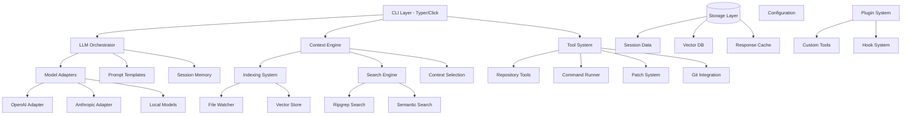

# Design Document

## Overview

Term-coder is architected as a modular Python CLI application that provides conversational coding assistance with repo-aware context. The system follows a layered architecture with clear separation between the CLI interface, core business logic, and external integrations. The design prioritizes safety through diff-based editing, extensibility through a plugin system, and performance through intelligent context selection and caching.

The architecture supports multiple LLM backends, hybrid search capabilities, and sandboxed command execution while maintaining a focus on developer experience through streaming responses and comprehensive session management.

## Architecture

### High-Level Architecture



### Core Components

1. **CLI Layer**: Command interface using Typer for type-safe command definitions
2. **Context Engine**: Manages repository understanding and context selection
3. **LLM Orchestrator**: Handles model interactions, prompt templating, and response streaming
4. **Tool System**: Provides safe execution environment for code operations
5. **Storage Layer**: Manages persistent data including sessions, vectors, and cache
6. **Plugin System**: Enables extensibility through custom tools and hooks

## Components and Interfaces

### CLI Layer (`cli.py`)

The CLI layer provides the primary user interface through a set of commands implemented with Typer for type safety and automatic help generation.

```python
# Core command interface
class TermCoderCLI:
    def __init__(self, config: Config, orchestrator: LLMOrchestrator):
        self.config = config
        self.orchestrator = orchestrator
    
    def chat(self, prompt: str, files: List[str] = None, model: str = None) -> None
    def edit(self, instruction: str, files: List[str] = None, write: bool = False) -> None
    def run(self, command: str, timeout: int = 30) -> CommandResult
    def fix(self, with_last_run: bool = False, file: str = None) -> None
    def search(self, query: str, semantic: bool = False, top: int = 20) -> SearchResults
```

**Key Design Decisions:**
- Typer for CLI framework due to excellent type hints and automatic validation
- Streaming output support for real-time feedback
- Command result caching for fix loops
- Consistent error handling and user feedback

### Context Engine (`context.py`)

The Context Engine is responsible for understanding the repository structure and selecting relevant context for LLM interactions.

```python
class ContextEngine:
    def __init__(self, index: IndexSystem, config: Config):
        self.index = index
        self.config = config
        self.recent_files = RecentFileTracker()
    
    def select_context(self, 
                      files: List[str] = None,
                      query: str = None, 
                      budget_tokens: int = 8000) -> ContextSelection
    
    def add_to_context(self, files: List[str]) -> None
    def remove_from_context(self, files: List[str]) -> None
    def get_active_context(self) -> List[ContextFile]
```

**Context Selection Algorithm:**
1. **Explicit Files**: Always include user-specified files
2. **Query Relevance**: Use hybrid search to find relevant files
3. **Recent Activity**: Prioritize recently edited files
4. **Dependency Analysis**: Include imported/referenced files
5. **Token Budget**: Fit within model context limits using intelligent chunking

### Indexing System (`index.py`)

The indexing system builds and maintains a searchable representation of the repository.

```python
class IndexSystem:
    def __init__(self, config: Config, vector_store: VectorStore):
        self.config = config
        self.vector_store = vector_store
        self.file_watcher = FileWatcher()
    
    def build_index(self, rebuild: bool = False) -> IndexStats
    def search_lexical(self, query: str, limit: int = 50) -> List[SearchResult]
    def search_semantic(self, query: str, limit: int = 20) -> List[SearchResult]
    def hybrid_search(self, query: str, alpha: float = 0.7) -> List[SearchResult]
```

**Indexing Strategy:**
- **File Discovery**: Respect `.gitignore` and `.term-coder/ignore` patterns
- **Content Chunking**: Split large files into semantic chunks (functions, classes)
- **Embedding Generation**: Use configurable embedding models (text-embedding-small default)
- **Incremental Updates**: Watch for file changes and update index incrementally
- **Hybrid Ranking**: Combine lexical (BM25) and semantic (cosine similarity) scores

### LLM Orchestrator (`llm.py`)

The LLM Orchestrator manages interactions with different language models and handles prompt templating.

```python
class LLMOrchestrator:
    def __init__(self, config: Config, session_manager: SessionManager):
        self.config = config
        self.session_manager = session_manager
        self.adapters = self._load_adapters()
    
    def chat(self, prompt: str, context: ContextSelection, model: str = None) -> StreamingResponse
    def edit(self, instruction: str, context: ContextSelection) -> EditProposal
    def explain(self, code: str, context: ContextSelection) -> Explanation
    def review(self, diff: str, context: ContextSelection) -> ReviewResult
```

**Model Adapter Interface:**
```python
class BaseLLMAdapter:
    def complete(self, prompt: str, tools: List[Tool] = None) -> Response
    def stream(self, prompt: str, tools: List[Tool] = None) -> Iterator[ResponseChunk]
    def estimate_tokens(self, text: str) -> int
```

**Supported Adapters:**
- **OpenAI Adapter**: GPT-3.5, GPT-4, GPT-4-turbo support
- **Anthropic Adapter**: Claude-3 family support
- **Local Adapter**: Ollama and OpenRouter integration
- **Cost Optimization**: Model selection based on task complexity and budget

### Patch System (`patcher.py`)

The patch system handles safe, reviewable file modifications through unified diffs.

```python
class PatchSystem:
    def __init__(self, config: Config, formatter_registry: FormatterRegistry):
        self.config = config
        self.formatters = formatter_registry
    
    def propose_patch(self, instruction: str, context: ContextSelection) -> PatchProposal
    def apply_patch(self, proposal: PatchProposal, mode: ApplyMode = ApplyMode.INTERACTIVE) -> ApplyResult
    def create_backup(self, files: List[str]) -> BackupInfo
    def rollback(self, backup_id: str) -> RollbackResult
```

**Patch Application Flow:**
1. **Generate Diff**: Create unified diff with context lines
2. **Safety Checks**: Verify files are tracked, check for conflicts
3. **Preview**: Show diff stats and summary to user
4. **Interactive Review**: Allow hunk-by-hunk selection
5. **Apply**: Apply selected changes with backup creation
6. **Format**: Run configured formatters on modified files
7. **Verify**: Optional post-apply verification

### Command Runner (`runner.py`)

The command runner provides sandboxed execution of shell commands with comprehensive logging.

```python
class CommandRunner:
    def __init__(self, config: Config, sandbox: SandboxConfig):
        self.config = config
        self.sandbox = sandbox
    
    def run_command(self, command: str, 
                   cwd: str = None, 
                   timeout: int = 30,
                   env: Dict[str, str] = None) -> CommandResult
    
    def get_last_run(self) -> CommandResult
    def capture_environment(self) -> EnvironmentSnapshot
```

**Sandbox Configuration:**
- **Resource Limits**: CPU time, memory usage, disk I/O limits
- **Network Isolation**: Optional network access restriction
- **File System**: Read-only access outside project directory
- **Process Limits**: Maximum subprocess count and execution time

### Git Integration (`gittools.py`)

Git integration provides repository-aware operations and workflow assistance.

```python
class GitIntegration:
    def __init__(self, repo_path: str):
        self.repo = git.Repo(repo_path)
    
    def get_diff(self, range_spec: str = "HEAD") -> GitDiff
    def stage_files(self, files: List[str]) -> None
    def commit(self, message: str, auto_generated: bool = False) -> CommitResult
    def create_pr_draft(self, target_branch: str, context: ContextSelection) -> PRDraft
    def analyze_changes(self, range_spec: str) -> ChangeAnalysis
```

## Data Models

### Core Data Structures

```python
@dataclass
class ContextFile:
    path: str
    content: str
    language: str
    relevance_score: float
    chunk_info: Optional[ChunkInfo] = None

@dataclass
class PatchProposal:
    instruction: str
    diff: str
    rationale: str
    affected_files: List[str]
    safety_score: float
    estimated_impact: ImpactAssessment

@dataclass
class CommandResult:
    command: str
    exit_code: int
    stdout: str
    stderr: str
    execution_time: float
    environment: EnvironmentSnapshot
    timestamp: datetime

@dataclass
class SearchResult:
    file_path: str
    content_snippet: str
    line_number: int
    relevance_score: float
    search_type: SearchType  # LEXICAL, SEMANTIC, HYBRID
```

### Configuration Schema

```yaml
# .term-coder/config.yaml
model:
  default: "gpt-3.5-turbo"
  heavy: "gpt-4"
  local: "ollama/codellama"

retrieval:
  max_files: 50
  max_tokens: 8000
  hybrid_weight: 0.7
  chunk_size: 1000
  chunk_overlap: 200

safety:
  require_confirmation: true
  create_backups: true
  max_file_size: 1048576  # 1MB

privacy:
  offline: false
  redact_secrets: true
  log_prompts: false

git:
  create_branch_on_edit: false
  auto_stage_patches: true
  commit_message_template: "AI: {summary}"

formatters:
  python: ["black", "isort"]
  javascript: ["prettier"]
  go: ["gofmt"]
```

## Error Handling

### Error Categories and Strategies

1. **User Input Errors**
   - Invalid file paths, malformed commands
   - Strategy: Clear error messages with suggestions

2. **Model API Errors**
   - Rate limits, authentication failures, network issues
   - Strategy: Exponential backoff, fallback models, offline mode

3. **File System Errors**
   - Permission issues, disk space, file locks
   - Strategy: Graceful degradation, user notification, retry mechanisms

4. **Git Operation Errors**
   - Merge conflicts, detached HEAD, uncommitted changes
   - Strategy: State detection, guided resolution, safe rollback

5. **Sandbox Violations**
   - Resource limit exceeded, security violations
   - Strategy: Process termination, detailed logging, user notification

### Error Recovery Mechanisms

```python
class ErrorHandler:
    def handle_model_error(self, error: ModelError) -> RecoveryAction
    def handle_file_error(self, error: FileSystemError) -> RecoveryAction
    def handle_git_error(self, error: GitError) -> RecoveryAction
    
    def suggest_recovery(self, error: Exception) -> List[RecoveryOption]
    def log_error(self, error: Exception, context: ErrorContext) -> None
```

## Testing Strategy

### Test Categories

1. **Unit Tests**
   - Individual component functionality
   - Mock external dependencies (LLM APIs, file system)
   - Focus on business logic and edge cases

2. **Integration Tests**
   - Component interaction testing
   - Real file system operations in isolated environments
   - End-to-end command flows

3. **Golden Tests**
   - Prompt template validation
   - Diff generation consistency
   - Model response format verification

4. **Performance Tests**
   - Context selection speed
   - Index build and search performance
   - Memory usage under load

### Test Infrastructure

```python
# Test utilities
class TestRepository:
    """Creates isolated git repositories for testing"""
    
class MockLLMAdapter:
    """Provides predictable responses for testing"""
    
class TemporaryWorkspace:
    """Manages test workspace lifecycle"""

# Golden test framework
class GoldenTestRunner:
    def run_prompt_test(self, test_case: PromptTestCase) -> TestResult
    def verify_diff_output(self, expected: str, actual: str) -> bool
    def update_golden_files(self, test_results: List[TestResult]) -> None
```

### Test Data Management

- **Repository Fixtures**: Pre-built test repositories with various scenarios
- **Golden Files**: Expected outputs for prompt templates and diff generation
- **Mock Responses**: Cached LLM responses for consistent testing
- **Performance Baselines**: Benchmarks for regression detection

## Security Considerations

### Input Sanitization

- **Command Injection Prevention**: Strict command validation and sandboxing
- **Path Traversal Protection**: Validate all file paths within project boundaries
- **Secret Redaction**: Automatic detection and redaction of API keys, passwords

### Sandbox Security

- **Process Isolation**: Separate process groups with resource limits
- **File System Restrictions**: Read-only access outside project directory
- **Network Controls**: Optional network access restriction
- **Privilege Dropping**: Run commands with minimal required privileges

### Data Privacy

- **Local Storage**: All sensitive data stored locally by default
- **Prompt Logging**: Configurable logging with automatic secret redaction
- **Model Selection**: Support for local models to avoid data transmission
- **Audit Trail**: Comprehensive logging of all system operations

This design provides a robust foundation for the term-coder system while maintaining flexibility for future enhancements and ensuring safety through comprehensive error handling and security measures.